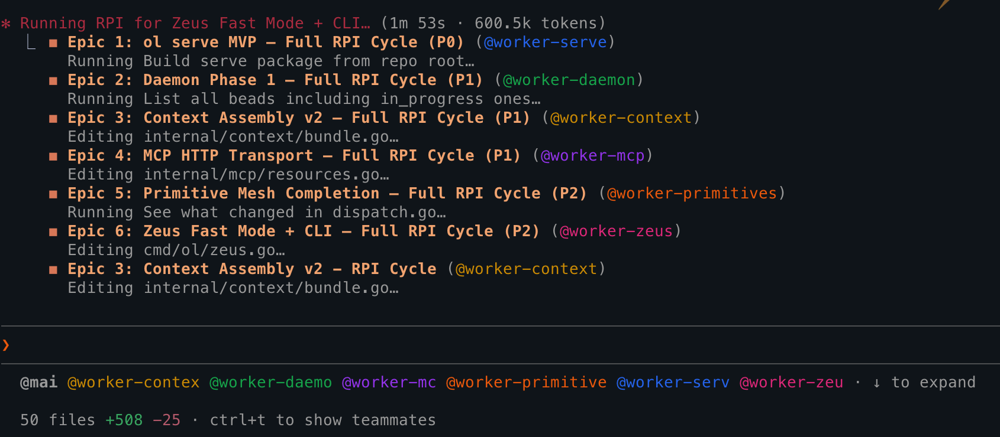
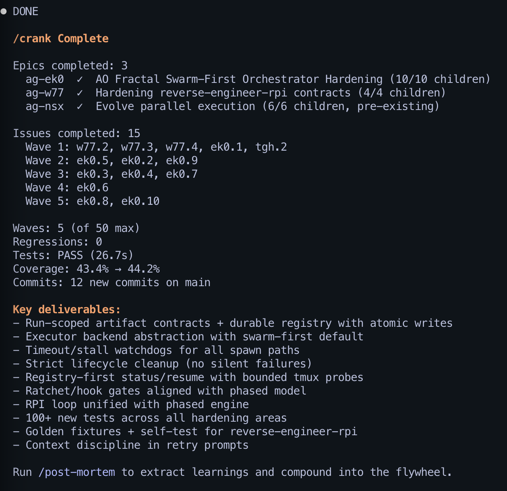

<div align="center">

# AgentOps

### Coding agents forget everything between sessions. This fixes that.

[How It Works](#how-it-works) · [Install](#install) · [See It Work](#see-it-work) · [Skills](#skills) · [CLI](#the-ao-cli) · [FAQ](#faq)

</div>

<p align="center">

<br>
<i>From goal to shipped code — agents research, plan, and implement in parallel. Councils validate before and after. Every learning feeds the next session.</i>
</p>

---

## How It Works

Coding agents get a blank context window every session. AgentOps is a toolbox of primitives — pick the ones you need, skip the ones you don't. Every skill works standalone. Swarm any of them for parallelism. Chain them into a pipeline when you want structure. Knowledge compounds between sessions automatically.

**DevOps' Three Ways** — applied to the agent loop as composable primitives:

- **Flow** (`/research`, `/plan`, `/crank`, `/swarm`, `/rpi`): orchestration skills that move work through the system. Single-piece flow, minimizing context switches. Swarm parallelizes any skill; crank runs dependency-ordered waves; rpi chains the full pipeline.
- **Feedback** (`/council`, `/vibe`, `/pre-mortem`, hooks): shorten the feedback loop until defects can't survive it. Independent judges catch issues before code ships. Hooks make the rules unavoidable — validation gates, push blocking, standards injection. Problems found Friday don't wait until Monday.
- **Learning** (`.agents/`, `ao` CLI, `/retro`, `/knowledge`): stop rediscovering what you already know. Every session extracts learnings into an append-only ledger, scores them by freshness, and re-injects the best ones at next session start. Session 50 knows what session 1 learned the hard way.

Here's what that looks like — your agent validates a PR, and the council verdict, decisions, and patterns are automatically written to `.agents/`. Three weeks later, different task, but your agent already knows:

```text
> /research "retry backoff strategies"

[inject] 3 prior learnings loaded (freshness-weighted):
  - Token bucket with Redis (established, high confidence)
  - Rate limit at middleware layer, not per-handler (pattern)
  - /login endpoint was missing rate limiting (decision)
[research] Found prior art in your codebase + injected context
           Recommends: exponential backoff with jitter, reuse existing Redis client
```

Session 5 didn't start from scratch — it started with what session 1 learned. Stale insights [decay automatically](docs/the-science.md).

- **Local-only** — no telemetry, no cloud, no accounts. Nothing phones home. Everything is [open source](cli/) — audit it yourself.
- **Multi-runtime** — Claude Code, Codex CLI, Cursor, OpenCode. Skills are portable across runtimes (`/converter` exports to native formats).
- **Multi-model councils** — independent judges (Claude + Codex) debate before code ships. Not advisory — validation gates block merges until they pass.

---

## Install

```bash
# Claude Code (recommended): marketplace + plugin install
claude plugin marketplace add boshu2/agentops
claude plugin install agentops@agentops-marketplace

# Codex CLI / Cursor
npx skills@latest add boshu2/agentops --all -g

# OpenCode
curl -fsSL https://raw.githubusercontent.com/boshu2/agentops/main/scripts/install-opencode.sh | bash
```

Then type `/quickstart` in your agent chat. Not sure which skill to run? See the **[Skill Router](docs/SKILL-ROUTER.md)**.

For Claude plugin installs, skills are available immediately after plugin install/update (restart Claude Code if prompted). To enable hooks and flywheel automation, install the `ao` CLI and run `ao init --hooks` in each repo.

`claude plugin install` is the primary path for Claude Code. `npx skills` remains the cross-agent install path for Codex CLI, Cursor, and mixed-runtime setups.

<details>
<summary><b>The ao CLI</b> — powers the knowledge flywheel</summary>

Skills work standalone. The `ao` CLI powers the automated learning loop — knowledge extraction, injection with freshness decay, maturity lifecycle, and progress gates. Install it when you want knowledge to compound between sessions.

```bash
brew tap boshu2/agentops https://github.com/boshu2/homebrew-agentops && brew install agentops
cd /path/to/your/repo
ao init --hooks
```

Update to the latest CLI later with:

```bash
brew update && brew upgrade agentops
ao version
```

This installs 30+ hooks across core lifecycle events:

| Event | What happens |
|-------|-------------|
| **SessionStart** | Extract from prior session, inject top learnings (freshness-weighted), check progress gates |
| **SessionEnd** | Mine transcript for knowledge, record session outcome, expire stale artifacts, evict dead knowledge |
| **PreToolUse** | Inject coding standards before edits, gate dangerous git ops, validate before push |
| **PostToolUse** | Advance progress ratchets, track citations |
| **TaskCompleted** | Validate task output against acceptance criteria |
| **Stop/PreCompact** | Close feedback loops, snapshot before compaction |

</details>

<details>
<summary><b>OpenCode</b> — plugin + skills</summary>

Installs 7 hooks (tool enrichment, audit logging, compaction resilience) and symlinks all skills. Restart OpenCode after install. Details: [.opencode/INSTALL.md](.opencode/INSTALL.md)

</details>

<details>
<summary><b>Configuration</b> — environment variables</summary>

All optional. AgentOps works out of the box with no configuration.

**Council / validation:**

| Variable | Default | What it does |
|----------|---------|-------------|
| `COUNCIL_TIMEOUT` | 120 | Judge timeout in seconds |
| `COUNCIL_CLAUDE_MODEL` | sonnet | Claude model for judges (`opus` for high-stakes) |
| `COUNCIL_CODEX_MODEL` | (user's Codex default) | Override Codex model for `--mixed` |
| `COUNCIL_EXPLORER_MODEL` | sonnet | Model for explorer sub-agents |
| `COUNCIL_EXPLORER_TIMEOUT` | 60 | Explorer timeout in seconds |
| `COUNCIL_R2_TIMEOUT` | 90 | Debate round 2 timeout in seconds |

**Hooks:**

| Variable | Default | What it does |
|----------|---------|-------------|
| `AGENTOPS_HOOKS_DISABLED` | 0 | `1` to disable all hooks (kill switch) |
| `AGENTOPS_PRECOMPACT_DISABLED` | 0 | `1` to disable pre-compaction snapshot |
| `AGENTOPS_TASK_VALIDATION_DISABLED` | 0 | `1` to disable task validation gate |
| `AGENTOPS_SESSION_START_DISABLED` | 0 | `1` to disable session-start hook |
| `AGENTOPS_EVICTION_DISABLED` | 0 | `1` to disable knowledge eviction |
| `AGENTOPS_GITIGNORE_AUTO` | 1 | `0` to skip auto-adding `.agents/` to `.gitignore` |
| `AGENTOPS_WORKER` | 0 | `1` to skip push gate (for worker agents) |

Full reference with examples and precedence rules: [docs/ENV-VARS.md](docs/ENV-VARS.md)

</details>

| What | Where | Reversible? |
|------|-------|:-----------:|
| Skills | Global skills dir (outside your repo; for Claude Code: `~/.claude/skills/`) | `npx skills@latest remove boshu2/agentops -g` |
| Knowledge artifacts | `.agents/` in your repo (git-ignored by default) | `rm -rf .agents/` |
| Hook registration | `.claude/settings.json` | `ao hooks uninstall` or delete entries |
| Git push gate | Pre-push hook (optional, only with CLI) | `AGENTOPS_HOOKS_DISABLED=1` |

Nothing modifies your source code.

Troubleshooting: [docs/troubleshooting.md](docs/troubleshooting.md)

---

## See It Work

Start simple. Work your way up. Each level builds on the last.

**1. Dip your toe** — one skill, one command:

```text
> /council validate this PR

[council] 3 judges spawned (independent, no anchoring)
[judge-1] PASS — token bucket implementation correct
[judge-2] WARN — rate limiting missing on /login endpoint
[judge-3] PASS — Redis integration follows middleware pattern
Consensus: WARN — add rate limiting to /login before shipping
```

**2. Full pipeline** — research through post-mortem, one command:

```text
> /rpi "add retry backoff to rate limiter"

[research]    Found 3 prior learnings on rate limiting (injected)
[plan]        2 issues, 1 wave → epic ag-0058
[pre-mortem]  Council validates plan → PASS (knew about Redis choice)
[crank]       Parallel agents: Wave 1 ██ 2/2
[vibe]        Council validates code → PASS
[post-mortem] 2 new learnings → .agents/
[flywheel]    Next: /rpi "add circuit breaker to external API calls"
```

**3. The endgame** — `/evolve`: define goals, walk away, come back to a better codebase.

This is what the whole system builds toward. Every skill — research, planning, parallel execution, council validation, knowledge extraction — composes into a single loop that measures what's wrong, fixes the worst thing, validates nothing regressed, extracts what it learned, and repeats. The [Ralph Wiggum Pattern](https://ghuntley.com/ralph/) gives each cycle fresh context. The knowledge flywheel means cycle 50 knows what cycle 1 learned. Goals give it intent. Regression gates give it safety. Memory gives it compounding.

```text
> /evolve

[evolve] GOALS.yaml: 28 goals loaded, score 77.0% (20/26 passing)

[cycle-1]     Worst: wiring-closure (weight 6) + 3 more
              /rpi "Fix failing goals" → score 93.3% (25/28) ✓

              ── the agent naturally organizes into phases ──

[cycle-2-35]  Coverage blitz: 17 packages from ~85% → ~97% avg
              Table-driven tests, edge cases, error paths
[cycle-38-59] Benchmarks added to all 15 internal packages
[cycle-60-95] Complexity annihilation: zero functions >= 8
              (was dozens >= 20 — extracted helpers, tested independently)
[cycle-96-116] Modernization: sentinel errors, exhaustive switches,
              Go 1.23 idioms (slices, cmp.Or, range-over-int)

[teardown]    203 files changed, 20K+ lines, 116 cycles
              All tests pass. Go vet clean. Avg coverage 97%.
              /post-mortem → 33 learnings extracted
              Ready for next /evolve — the floor is now the ceiling.
```

That ran overnight — ~7 hours, unattended, on this repo. Every cycle committed with a traceable message. Regression gates auto-reverted anything that broke a previously-passing goal. The agent built its own safety net first (tests), then used that safety net to refactor aggressively (complexity), then polished (modernization). Nobody told it to do that — severity-based goal selection naturally produces the correct ordering.

<p align="center">

<br>
<i>AgentOps building AgentOps: `/crank` across 3 parallel epics (15 issues, 5 waves, 0 regressions).</i>
</p>

<details>
<summary><b>More examples</b> — swarm, session continuity, different workflows</summary>

<br>

**Parallelize anything** with `/swarm`:

```text
> /swarm "research auth patterns, brainstorm rate limiting improvements"

[swarm] 3 agents spawned — each gets fresh context
[agent-1] /research auth — found JWT + session patterns, 2 prior learnings
[agent-2] /research rate-limiting — found token bucket, middleware pattern
[agent-3] /brainstorm improvements — 4 approaches ranked
[swarm] Complete — artifacts in .agents/
```

**Session continuity across compaction or restart:**
```text
> /handoff
[handoff] Saved: 3 open issues, current branch, next action
         Continuation prompt written to .agents/handoffs/

--- next session ---

> /recover
[recover] Found in-progress epic ag-0058 (2/5 issues closed)
          Branch: feature/rate-limiter
          Next: /implement ag-0058.3
```

**Different developers, different setups:**

| Workflow | Commands | What happens |
|----------|----------|-------------|
| **PR reviewer** | `/council validate this PR` | One command, actionable feedback, no setup |
| **Team lead** | `/research` → `/plan` → `/council validate` | Compose skills manually, stay in control |
| **Solo dev** | `/rpi "add user auth"` | Research through post-mortem, walk away |
| **Platform team** | `/swarm` + `/evolve` | Parallel pipelines + fitness-scored improvement loop |

</details>

Not sure which skill to run? See the [Skill Router](docs/SKILL-ROUTER.md).

---

## Skills

Every skill works alone. Compose them however you want.

**Judgment** — the foundation everything validates against:

| Skill | What it does |
|-------|-------------|
| `/council` | Independent judges (Claude + Codex) debate, surface disagreement, converge. `--preset=security-audit`, `--perspectives`, `--debate` for adversarial review |
| `/vibe` | Code quality review — complexity analysis + council |
| `/pre-mortem` | Validate plans before implementation — council simulates failures |
| `/post-mortem` | Wrap up completed work — council validates + retro extracts learnings |

**Execution** — research, plan, build, ship:

| Skill | What it does |
|-------|-------------|
| `/research` | Deep codebase exploration — produces structured findings |
| `/plan` | Decompose a goal into trackable issues with dependency waves |
| `/implement` | Full lifecycle for one task — research, plan, build, validate, learn |
| `/crank` | Parallel agents in dependency-ordered waves, fresh context per worker |
| `/swarm` | Parallelize any skill — run research, brainstorms, implementations in parallel |
| `/rpi` | Full pipeline: discovery (research + plan + pre-mortem) → implementation (crank) → validation (vibe + post-mortem) |
| `/evolve` | The endgame: measure goals, fix the worst gap, regression-gate everything, learn, repeat overnight |

**Knowledge** — the flywheel that makes sessions compound:

| Skill | What it does |
|-------|-------------|
| `/knowledge` | Query learnings, patterns, and decisions across `.agents/` |
| `/learn` | Manually capture a decision, pattern, or lesson |
| `/retro` | Extract learnings from completed work |
| `/flywheel` | Monitor knowledge health — velocity, staleness, pool depths |

**Supporting skills:**

| | |
|---|---|
| **Onboarding** | `/quickstart`, `/using-agentops` |
| **Session** | `/handoff`, `/recover`, `/status` |
| **Traceability** | `/trace`, `/provenance` |
| **Product** | `/product`, `/goals`, `/release`, `/readme`, `/doc` |
| **Utility** | `/brainstorm`, `/bug-hunt`, `/complexity` |

Full reference: [docs/SKILLS.md](docs/SKILLS.md)

<details>
<summary><b>Cross-runtime orchestration</b> — mix Claude, Codex, OpenCode</summary>

AgentOps orchestrates across runtimes. Claude can lead a team of Codex workers. Codex judges can review Claude's output.

| Spawning Backend | How it works | Best for |
|-----------------|-------------|----------|
| **Native teams** | `TeamCreate` + `SendMessage` — built into Claude Code | Tight coordination, debate |
| **Background tasks** | `Task(run_in_background=true)` — last-resort fallback | When no team APIs available |
| **Codex sub-agents** | `/codex-team` — Claude orchestrates Codex workers | Cross-vendor validation |
| **tmux + Agent Mail** | `/swarm --mode=distributed` — full process isolation | Long-running work, crash recovery |

</details>

Distributed mode workers survive disconnects — each runs in its own tmux session with crash recovery. `tmux attach` to debug live.

<details>
<summary><b>Custom agents</b> — why AgentOps ships its own</summary>

AgentOps includes two small, purpose-built agents that fill gaps between Claude Code's built-in agent types:

| Agent | Model | Can do | Can't do |
|-------|-------|--------|----------|
| `agentops:researcher` | haiku | Read, search, **run commands** (`gocyclo`, `go test`, etc.) | Write or edit files |
| `agentops:code-reviewer` | sonnet | Read, search, run `git diff`, produce structured findings | Write or edit files |

**The gap they fill:** Claude Code's built-in `Explore` agent can search code but can't run commands. Its `general-purpose` agent can do everything but uses the primary model (expensive) and has full write access. The custom agents sit in between — read-only discipline with command execution, at lower cost.

| Need | Best agent |
|------|-----------|
| Find a file or function | `Explore` (fastest) |
| Explore + run analysis tools | `agentops:researcher` (haiku, read-only + Bash) |
| Make changes to files | `general-purpose` (full access) |
| Review code after changes | `agentops:code-reviewer` (sonnet, structured review) |

Skills spawn these agents automatically — you don't pick them manually. `/research` uses the researcher, `/vibe` uses the code-reviewer, `/crank` uses general-purpose for workers.

</details>

---

## Deep Dive

How the knowledge system and pipeline phases work under the hood.

### The Knowledge Ledger

`.agents/` is an append-only ledger with cache-like semantics. Nothing gets overwritten — every learning, council verdict, pattern, and decision is a new dated file. Freshness decay prunes what's stale. The cycle:

```
Session N ends
    → ao forge: mine transcript for learnings, decisions, patterns
    → ao maturity --expire: mark stale artifacts (freshness decay)
    → ao maturity --evict: archive what's decayed past threshold

Session N+1 starts
    → ao inject --apply-decay: score all artifacts by recency,
      inject top-N within token budget
    → Agent starts with institutional knowledge, not a blank slate
```

Write once, score by freshness, inject the best, prune the rest. If `retrieval_rate × usage_rate` stays above decay and scale friction, knowledge compounds. If not, growth stalls unless fresh input or stronger controls are added. The [formal model](docs/the-science.md) is cache eviction with a decay function and limits-to-growth controls.

```
  /rpi "goal"
    │
    ├── /research → /plan → /pre-mortem → /crank → /vibe
    │
    ▼
  /post-mortem
    ├── validates what shipped
    ├── extracts learnings → .agents/
    └── suggests next /rpi command ────┐
                                       │
   /rpi "next goal" ◄──────────────────┘
```

The post-mortem analyzes each learning, asks "what process would this improve?", and writes improvement proposals. It hands you a ready-to-copy `/rpi` command. Paste it, walk away.

Learnings pass quality gates (specificity, actionability, novelty) and land in tiered pools. Freshness decay ensures recent insights outweigh stale patterns.

<details>
<summary><b>Phase details</b> — what each step does</summary>

1. **`/research`** — Explores your codebase. Produces a research artifact with findings and recommendations.

2. **`/plan`** — Decomposes the goal into issues with dependency waves. Derives scope boundaries and conformance checks. Creates a [beads](https://github.com/steveyegge/beads) epic (git-native issue tracking).

3. **`/pre-mortem`** — Judges simulate failures before you write code, including a spec-completeness judge. FAIL? Re-plan with feedback (max 3 retries).

4. **`/crank`** — Spawns parallel agents in dependency-ordered waves. Each worker gets fresh context. Lead validates and commits. Runs until every issue is closed. `--test-first` for spec-first TDD.

5. **`/vibe`** — Judges validate the code. FAIL? Re-crank with failure context and re-vibe (max 3).

6. **`/post-mortem`** — Council validates the implementation. Retro extracts learnings. **Suggests the next `/rpi` command.**

`/rpi "goal"` runs all six end to end. Use `--interactive` for human gates at research and plan.

</details>

<details>
<summary><b>Phased RPI</b> — fresh context per phase for larger goals</summary>

`ao rpi phased "goal"` runs each phase in its own session — no context bleed between phases. Use `/rpi` when context fits in one session. Use `ao rpi phased` when you need phase-level resume control. For autonomous control-plane operation, use the canonical path `ao rpi loop --supervisor`. See [The ao CLI](#the-ao-cli) for examples.

</details>

<details>
<summary><b>Setting up /evolve</b> — GOALS.yaml and the fitness loop</summary>

Bootstrap with `/goals generate` — it scans your repo (PRODUCT.md, README, skills, tests) and proposes mechanically verifiable goals. Or write them by hand:

```yaml
# GOALS.yaml
version: 1
goals:
  - id: test-pass-rate
    description: "All tests pass"
    check: "make test"
    weight: 10
```

`/evolve` measures them, picks the worst gap by weight, runs `/rpi` to fix it, re-measures ALL goals (regressed commits auto-revert), and loops. It commits locally — you control when to push. Kill switch: `echo "stop" > ~/.config/evolve/KILL`

**Built for overnight runs.** Cycle state lives on disk, not in LLM memory — survives context compaction. Every cycle writes to `cycle-history.jsonl` with verified writes, a regression gate that refuses to proceed without a valid fitness snapshot, and a watchdog heartbeat for external monitoring. If anything breaks the tracking invariant, the loop stops rather than continuing ungated. See `skills/SKILL-TIERS.md` for the two-tier execution model that keeps the orchestrator visible while workers fork.

Maintain over time: `/goals` shows pass/fail status, `/goals prune` finds stale or broken checks.

</details>

<details>
<summary><b>References</b> — science, systems theory, prior art</summary>

Built on [Darr 1995](docs/the-science.md) (decay rates), Sweller 1988 (cognitive load), [Liu et al. 2023](docs/the-science.md) (lost-in-the-middle), [MemRL 2025](https://arxiv.org/abs/2601.03192) (RL for memory).

AgentOps concentrates on the high-leverage end of [Meadows' hierarchy](https://en.wikipedia.org/wiki/Twelve_leverage_points): information flows (#6), rules (#5), self-organization (#4), goals (#3). The bet: changing the loop beats tuning the output.

Deep dive: [docs/how-it-works.md](docs/how-it-works.md) — Brownian Ratchet, Ralph Wiggum Pattern, agent backends, hooks, context windowing.

</details>

---

## The `ao` CLI

Skills work standalone — no CLI required. The `ao` CLI adds two things: (1) the knowledge flywheel that makes sessions compound (extract, inject, decay, maturity), and (2) terminal-based RPI that runs without an active chat session. Each phase gets its own fresh context window, so large goals don't hit context limits.

```bash
ao rpi loop --supervisor --max-cycles 1        # Canonical autonomous cycle (policy-gated landing)
ao rpi loop --supervisor "fix auth bug"        # Single explicit-goal supervised cycle
ao rpi phased --from=implementation "ag-058"   # Resume a specific phased run at build phase
ao rpi status --watch                          # Monitor active/terminal runs
```

Walk away, come back to committed code + extracted learnings.

Supervisor determinism contract: task failures mark queue entries failed, infrastructure failures leave queue entries retryable, and `ao rpi cancel` ignores stale supervisor lease metadata. For recovery/hygiene, pair `ao rpi cancel` with `ao rpi cleanup --all --prune-worktrees --prune-branches`.

```bash
ao search "query"      # Search knowledge across files and chat history
ao demo                # Interactive demo
```

Full reference: [CLI Commands](cli/docs/COMMANDS.md)

---

## Architecture

Five pillars, one recursive shape. The same pattern — lead decomposes work, workers execute atomically, validation gates lock progress, next wave begins — repeats at every scale:

```
/implement ── one worker, one issue, one verify cycle
    └── /crank ── waves of /implement (FIRE loop)
        └── /rpi ── research → plan → crank → validate → learn
            └── /evolve ── fitness-gated /rpi cycles
```

Each level treats the one below as a black box: spec in, validated result out. Workers get fresh context per wave ([Ralph Wiggum Pattern](https://ghuntley.com/ralph/)), never commit (lead-only), and communicate through the filesystem — not accumulated chat context. Parallel execution works because each unit of work is **atomic**: no shared mutable state with concurrent workers.

**Two-tier execution model.** Skills follow a strict rule: *the orchestrator never forks; the workers it spawns always fork.* Orchestrators (`/evolve`, `/rpi`, `/crank`, `/vibe`, `/post-mortem`) stay in the main session so you can see progress and intervene. Worker spawners (`/council`, `/codex-team`) fork into subagents where results merge back via the filesystem. This was learned the hard way — orchestrators that forked became invisible, losing cycle-by-cycle visibility during long runs. See [`SKILL-TIERS.md`](skills/SKILL-TIERS.md) for the full classification.

Validation is mechanical, not advisory. [Multi-model councils](docs/ARCHITECTURE.md#pillar-2-brownian-ratchet) judge before and after implementation. [Hooks](docs/how-it-works.md) enforce gates — push blocked until `/vibe` passes, `/crank` blocked until `/pre-mortem` passes. The [knowledge flywheel](docs/ARCHITECTURE.md#pillar-4-knowledge-flywheel) extracts learnings, scores them, and re-injects them at session start so each cycle compounds.

Full treatment: [docs/ARCHITECTURE.md](docs/ARCHITECTURE.md) — all five pillars, operational invariants, component overview.

---

## How AgentOps Fits With Other Tools

These are fellow experiments in making coding agents work. Use pieces from any of them.

| Alternative | What it does well | Where AgentOps focuses differently |
|-------------|-------------------|-------------------------------------|
| **[GSD](https://github.com/glittercowboy/get-shit-done)** | Clean subagent spawning, fights context rot | Cross-session memory (GSD keeps context fresh *within* a session; AgentOps carries knowledge *between* sessions) |
| **[Compound Engineer](https://github.com/EveryInc/compound-engineering-plugin)** | Knowledge compounding, structured loop | Multi-model councils and validation gates — independent judges debating before and after code ships |

[Detailed comparisons →](docs/comparisons/)

---

## FAQ

[docs/FAQ.md](docs/FAQ.md) — comparisons, limitations, subagent nesting, PRODUCT.md, uninstall.

---

<details>
<summary><b>Built on</b> — Ralph Wiggum, Multiclaude, beads, CASS, MemRL</summary>

[Ralph Wiggum](https://ghuntley.com/ralph/) (fresh context per agent) · [Multiclaude](https://github.com/dlorenc/multiclaude) (validation gates) · [beads](https://github.com/steveyegge/beads) (git-native issues) · [CASS](https://github.com/Dicklesworthstone/coding_agent_session_search) (session search) · [MemRL](https://arxiv.org/abs/2601.03192) (cross-session memory)

</details>

## Contributing

<details>
<summary><b>Issue tracking</b> — Beads / bd</summary>

Git-native issues in `.beads/`. `bd onboard` (setup) · `bd ready` (find work) · `bd show <id>` · `bd close <id>` · `bd sync`. More: [AGENTS.md](AGENTS.md)

</details>

See [CONTRIBUTING.md](CONTRIBUTING.md). If AgentOps helped you ship something, post in [Discussions](https://github.com/boshu2/agentops?tab=discussions).

## License

Apache-2.0 · [Docs](docs/INDEX.md) · [How It Works](docs/how-it-works.md) · [FAQ](docs/FAQ.md) · [Glossary](docs/GLOSSARY.md) · [Architecture](docs/ARCHITECTURE.md) · [Configuration](docs/ENV-VARS.md) · [CLI Reference](cli/docs/COMMANDS.md) · [Changelog](CHANGELOG.md)
